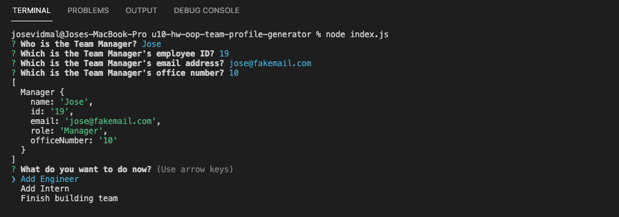

# u10-hw-oop-team-profile-generator
ITESM Coding Bootcamp - Unit 10 Homework - Object Oriented Programming: Team Profile Generator

## Description

This was a Job-Seeking coding assessment, where I was required to build a Node.js application. The app uses Inquirer.js package to prompt a series of questions in the CLI after initialization. Then, the user will answer each question to register a development team, with one Manager and as many Engineers and Interns as the user wants. As soon as the user selects the "Finish building team" option in the corresponding question, the application generates an index.html file with all the information for each team member. It also creates a style.css file to apply different CSS properties to the HTML elements in the index.html file.   

First, I worked the code in an empty template.html and sample.css files, this in order to get the correct layout for the header as well as the cards that would contain the information for each team member.

Then, to start building the Node.js application, I used a Test Driven Development (TDD) approach using the Jest package. First, I created 4 test.js files, these for the Employee Class and Manager, Engineer and Intern Subclasses. In the Employee.test.ja file I wrote code to check a Class function that would have a constructor to create an object with "name", "id", "email" and "role" properties, it would also have some functions to get the values of those properties. Then, for the Subclasses I wrote code to test Class functions that would create objects inheriting the properties of the main Employee Class, and include other functions to add complementary properties of each Subclass. Once this was done, I wrote the corresponding code in the Employee.js, Manager.js, Engineer.js and Intern.js files to pass each test. To move on, I used the CLI to enter the `npm run test` command to verify that the code in each .js file would pass.

Next, I used the Inquirer.js package to write the code in the index.js file. Since the questions would need loop each time the user selects to add a new member, I separated the prompted questions in 4 functions: `mgrQuestions()`, `addMember()`, `engQuestions()` and `intQuestions()`. The `addMember()` function would be the one used to make the loop (if the user selects the "Add Engineer" or "Add Intern" options from the list question), and eventually generate the index.html and style.css (using the `fs` module `writeFile` method) once the user selects the "Finish building team" option. 

Finally, I used the helper.js file to create an empty array (`const teamMembers = []`) and 3 functions: `renderSection(item)`, `generateHTML()` and `generateCSS()`. These would be used to generate the HTML code for each team member card, the rest of the main HTML code and the CSS code for the style (all this came from the template.html and sample.css files).   

## Usage

The application looks like this when it is used:

Once the user selects the "Finish building team" option, from the list at the "What do you want to do now?" question, the app generates index.html and style.css files, which in conjunction show the team members information like this: 

To see the application in use watch the following [Walkthrough Video](https://drive.google.com/file/d/16F9HmEmcsVlzKNxtMtGKBWfUmoWkeg0X/view?usp=sharing)

You can check these [index.html](./dist/index.html) and [style.css](./dist/style.css) files, which were generated using this application.

## Technologies Used

* JavaScript
* Object Oriented Programming
* Node.js
* NPM
* HTML
* CSS
* Google Fonts
* Font Awesome
* Inquirer.js package
* Jest package
* File System (fs) module

## Contact Information

* GitHub Profile: [josevidmal](https://github.com/josevidmal)
* email: josevidmal@gmail.com

## License

[The MIT License](https://www.mit.edu/~amini/LICENSE.md)

Copyright 2022 Jose Vidal

Permission is hereby granted, free of charge, to any person obtaining a copy of this software and associated documentation files (the "Software"), to deal in the Software without restriction, including without limitation the rights to use, copy, modify, merge, publish, distribute, sublicense, and/or sell copies of the Software, and to permit persons to whom the Software is furnished to do so, subject to the following conditions:
    
The above copyright notice and this permission notice shall be included in all copies or substantial portions of the Software.
    
THE SOFTWARE IS PROVIDED "AS IS", WITHOUT WARRANTY OF ANY KIND, EXPRESS OR IMPLIED, INCLUDING BUT NOT LIMITED TO THE WARRANTIES OF MERCHANTABILITY, FITNESS FOR A PARTICULAR PURPOSE AND NONINFRINGEMENT. IN NO EVENT SHALL THE AUTHORS OR COPYRIGHT HOLDERS BE LIABLE FOR ANY CLAIM, DAMAGES OR OTHER LIABILITY, WHETHER IN AN ACTION OF CONTRACT, TORT OR OTHERWISE, ARISING FROM, OUT OF OR IN CONNECTION WITH THE SOFTWARE OR THE USE OR OTHER DEALINGS IN THE SOFTWARE.